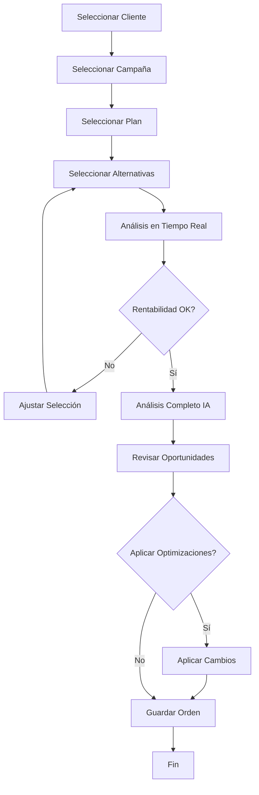
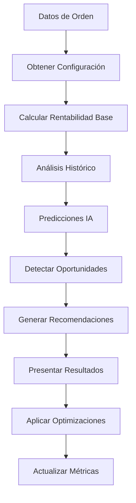
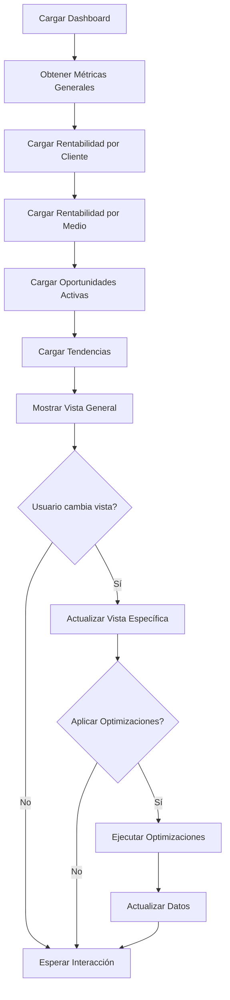

# 🧠 Módulo de Rentabilidad Inteligente - Documentación Completa

## 📋 Tabla de Contenidos

1. [Overview](#overview)
2. [Arquitectura del Sistema](#arquitectura-del-sistema)
3. [Modelo de Negocio](#modelo-de-negocio)
4. [Componentes del Módulo](#componentes-del-módulo)
5. [Base de Datos](#base-de-datos)
6. [Servicios](#servicios)
7. [Integración con IA](#integración-con-ia)
8. [Flujos de Trabajo](#flujos-de-trabajo)
9. [Métricas y KPIs](#métricas-y-kpis)
10. [Implementación](#implementación)
11. [Testing](#testing)
12. [Mantenimiento](#mantenimiento)

## 🎯 Overview

El Módulo de Rentabilidad Inteligente es una solución avanzada diseñada específicamente para **agencias de medios** que maximiza la rentabilidad a través del análisis multi-dimensional de tres fuentes principales de ingresos:

1. **Comisiones de Clientes** (% sobre inversión)
2. **Bonificaciones de Medios** (comisiones que pagan los medios a la agencia)
3. **Markup** (diferencia entre descuento real y precio informado al cliente)

### 🚀 Objetivos Principales

- **Maximizar Rentabilidad**: Optimizar las tres fuentes de ingresos simultáneamente
- **Inteligencia Artificial**: Predicción y recomendaciones basadas en datos históricos
- **Análisis en Tiempo Real**: Rentabilidad calculada durante la creación de órdenes
- **Visibilidad Completa**: Dashboard multi-dimensional con métricas detalladas
- **Oportunidades Automáticas**: Detección de oportunidades de mejora con IA

## 🏗️ Arquitectura del Sistema

```
┌─────────────────────────────────────────────────────────────┐
│                    Frontend React                          │
├─────────────────────────────────────────────────────────────┤
│  ┌─────────────────┐  ┌─────────────────┐  ┌─────────────────┐ │
│  │ Rentabilidad    │  │ CrearOrden con  │  │ Dashboard       │ │
│  │ Dashboard       │  │ Rentabilidad    │  │ Components      │ │
│  └─────────────────┘  └─────────────────┘  └─────────────────┘ │
└─────────────────────────────────────────────────────────────┘
                              │
                              ▼
┌─────────────────────────────────────────────────────────────┐
│                    Services Layer                           │
├─────────────────────────────────────────────────────────────┤
│  ┌─────────────────┐  ┌─────────────────┐  ┌─────────────────┐ │
│  │ Rentabilidad    │  │ Error Handling  │  │ SweetAlert       │ │
│  │ Inteligente     │  │ Service         │  │ Utils           │ │
│  │ Service         │  │                 │  │                 │ │
│  └─────────────────┘  └─────────────────┘  └─────────────────┘ │
└─────────────────────────────────────────────────────────────┘
                              │
                              ▼
┌─────────────────────────────────────────────────────────────┐
│                   Database Layer                            │
├─────────────────────────────────────────────────────────────┤
│  ┌─────────────────┐  ┌─────────────────┐  ┌─────────────────┐ │
│  │ Detalles        │  │ Oportunidades   │  │ Métricas de     │ │
│  │ Financieros     │  │ Rentabilidad    │  │ Rentabilidad    │ │
│  └─────────────────┘  └─────────────────┘  └─────────────────┘ │
└─────────────────────────────────────────────────────────────┘
```

## 💰 Modelo de Negocio

### Fuentes de Ingresos de Agencias de Medios

#### 1. **Comisiones de Clientes**
- **Porcentaje**: % sobre la inversión total del cliente
- **Configuración**: Puede ser base, escalable por volumen, o fija
- **Optimización**: IA sugiere estructuras óptimas según cliente y volumen

#### 2. **Bonificaciones de Medios**
- **Origen**: Comisiones que los medios pagan a la agencia
- **Factores**: Volumen de compra, relación con el medio, temporada
- **Optimización**: IA predice bonificaciones negociables

#### 3. **Markup**
- **Definición**: Diferencia entre descuento obtenido y precio informado al cliente
- **Cálculo**: (Precio Informado - Costo Real - Comisiones)
- **Optimización**: IA identifica oportunidades de markup no explotadas

### 📊 Fórmula de Rentabilidad

```
Rentabilidad Neta = Comisiones Cliente + Bonificaciones Medios + Markup
Rentabilidad % = (Rentabilidad Neta / Inversión Total) × 100
```

## 🧩 Componentes del Módulo

### 1. **RentabilidadDashboard** 
**Ruta**: `/rentabilidad`

Dashboard principal con visualización multi-dimensional:

- **Métricas Principales**: Rentabilidad general, inversión total, comisiones, bonificaciones, markup
- **Vistas Múltiples**: General, por cliente, por medio, oportunidades, tendencias
- **Análisis en Tiempo Real**: Actualización automática de métricas
- **Interacción IA**: Aplicación de optimizaciones sugeridas

### 2. **CrearOrdenConRentabilidad**
**Ruta**: `/ordenes/crear-con-rentabilidad`

Formulario de creación de órdenes con análisis integrado:

- **Step 1**: Datos básicos (cliente, campaña, plan)
- **Step 2**: Selección de alternativas con análisis de rentabilidad
- **Step 3**: Análisis completo de rentabilidad con IA
- **Panel en Tiempo Real**: Rentabilidad calculada durante la selección

### 3. **RentabilidadInteligenteService**
Servicio central de lógica de negocio:

- **Análisis de Rentabilidad**: Cálculo detallado por alternativa
- **Predicciones IA**: Markup potencial, bonificaciones, optimización
- **Detección de Oportunidades**: Identificación automática de mejoras
- **Cálculo de Métricas**: Eficiencia, rentabilidad, tendencias

## 🗄️ Base de Datos

### Tablas Principales

#### **DetallesFinancierosOrden**
Registro completo de rentabilidad por orden:
```sql
- costo_real_medio: Costo real del medio
- precio_informado_cliente: Precio facturado al cliente
- comision_cliente_*: Configuración y montos de comisiones
- bonificacion_medio_*: Bonificaciones obtenidas
- markup_*: Markup calculado
- rentabilidad_*: Rentabilidad neta y porcentual
```

#### **ConfiguracionComisiones**
Configuración de comisiones por cliente:
```sql
- comision_base_porcentaje: Comisión base
- comision_escalable: Configuración por volumen
- comisiones_por_medio: Configuraciones específicas JSON
```

#### **RegistroBonificacionesMedios**
Bonificaciones ofrecidas por medios:
```sql
- bonificacion_base_porcentaje: Bonificación base
- bonificacion_escala: Configuración escalable
- escalas_bonificacion: Umbrales y porcentajes JSON
```

#### **OportunidadesRentabilidad**
Oportunidades detectadas por IA:
```sql
- tipo_oportunidad: markup, comision, bonificacion
- impacto_estimado: Impacto potencial en dinero
- confianza_ia: Nivel de confianza de la predicción
- estado: detectada, evaluando, aplicada, rechazada
```

### Vistas Optimizadas

#### **vw_rentabilidad_cliente**
Rentabilidad consolidada por cliente:
```sql
SELECT 
    c.id_cliente,
    c.nombreCliente,
    SUM(dr.rentabilidad_neta) as rentabilidad_total,
    SUM(dr.comision_cliente_monto) as comisiones_total,
    SUM(dr.bonificacion_medio_monto) as bonificaciones_total,
    SUM(dr.markup_monto) as markup_total,
    (SUM(dr.rentabilidad_neta) / SUM(dr.precio_informado_cliente)) * 100 as rentabilidad_porcentaje
FROM Clientes c
LEFT JOIN DetallesFinancierosOrden dr ON c.id_cliente = dr.id_orden
GROUP BY c.id_cliente;
```

## 🔧 Servicios

### RentabilidadInteligenteService

#### Métodos Principales

```javascript
// Análisis completo de rentabilidad para una orden
async analizarRentabilidadOrden(idOrden)

// Análisis por alternativa individual
async analizarRentabilidadAlternativa(alternativa, orden)

// Predicción de optimización con IA
async predecirOptimizacion(alternativa, orden, calculosActuales)

// Detección de oportunidades de mejora
async detectarOportunidadesIA(orden, analisisAlternativas)

// Cálculo detallado de rentabilidad
calcularRentabilidadDetallada(costoReal, precioInformado, configComision, bonificacionMedio)

// Obtener métricas para dashboard
async obtenerMetricasDashboard(filtros)
```

#### Algoritmos de IA

```javascript
// Predicción de markup potencial
async predecirMarkupPotencial(alternativa, orden, historicoSimilares)

// Predicción de bonificaciones
async predecirBonificacionPotencial(idSoporte, montoOrden)

// Optimización de comisiones
async optimizarComisionCliente(idCliente, montoOrden)

// Cálculo de confianza
calcularConfianza(cantidadDatosHistoricos)
```

## 🤖 Integración con IA

### Modelos Implementados

#### **1. Markup Prediction Model**
- **Entrada**: Histórico de negociaciones, factores estacionales, volumen
- **Salida**: Markup potencial con nivel de confianza
- **Algoritmo**: Análisis de percentiles y ajuste contextual

#### **2. Commission Optimization Model**
- **Entrada**: Configuración actual, volumen de compra, tipo de cliente
- **Salida**: Estructura de comisiones óptima
- **Algoritmo**: Optimización por reglas y Machine Learning

#### **3. Negotiation Success Model**
- **Entrada**: Medio, proveedor, temporada, volumen, urgencia
- **Salida**: Probabilidad de éxito y factores clave
- **Algoritmo**: Análisis histórico y clasificación

### Proceso de Decisión IA

```
1. Recopilar Datos Históricos
   ↓
2. Analizar Patrones Similares
   ↓
3. Calcular Predicciones
   ↓
4. Validar con Reglas de Negocio
   ↓
5. Generar Recomendaciones
   ↓
6. Calcular Confianza
   ↓
7. Presentar Oportunidades
```

## 🔄 Flujos de Trabajo

### 1. **Flujo de Creación de Orden con Rentabilidad**



### 2. **Flujo de Análisis de Rentabilidad**



### 3. **Flujo de Dashboard**



## 📈 Métricas y KPIs

### KPIs Principales

#### **Rentabilidad**
- **Rentabilidad General**: % total sobre inversión
- **Rentabilidad por Cliente**: Análisis individual
- **Rentabilidad por Medio**: Eficiencia por canal
- **Rentabilidad por Campaña**: Análisis de proyectos

#### **Eficiencia**
- **Eficiencia de Markup**: Markup real / markup potencial
- **Eficiencia de Comisiones**: Comisión real / comisión máxima
- **Eficiencia de Bonificaciones**: Bonificación obtenida / disponible

#### **Oportunidades**
- **Oportunidades Detectadas**: Total identificadas por IA
- **Oportunidades Aplicadas**: Total implementadas
- **Impacto Real**: Mejora obtenida después de aplicar
- **Tasa de Conversión**: % de oportunidades aplicadas

### Métricas Operativas

#### **Por Cliente**
```javascript
{
  inversion_total: 1500000,
  rentabilidad_total: 375000,
  rentabilidad_porcentaje: 25.0,
  comisiones_total: 150000,
  bonificaciones_total: 75000,
  markup_total: 150000,
  eficiencia: 85.5,
  numero_ordenes: 12,
  ticket_promedio: 125000
}
```

#### **Por Medio**
```javascript
{
  nombredelmedio: "TV Abierta",
  inversion_total: 800000,
  rentabilidad_total: 240000,
  rentabilidad_porcentaje: 30.0,
  bonificaciones_total: 80000,
  markup_total: 120000,
  numero_ordenes: 8,
  descuento_promedio: 15.5
}
```

## 🚀 Implementación

### 1. **Instalación de Dependencias**

```bash
npm install sweetalert2
npm install @supabase/supabase-js
```

### 2. **Configuración de Base de Datos**

```sql
-- Ejecutar script de creación de tablas
\i database-rentabilidad-schema.sql

-- Crear vistas optimizadas
\i database-rentabilidad-views.sql

-- Insertar datos iniciales
\i database-rentabilidad-seed.sql
```

### 3. **Configuración de Variables de Entorno**

```env
# Configuración de Supabase
VITE_SUPABASE_URL=tu_supabase_url
VITE_SUPABASE_ANON_KEY=tu_supabase_anon_key

# Configuración de IA (opcional)
VITE_AI_API_KEY=tu_ai_api_key
VITE_AI_MODEL_ENDPOINT=tu_model_endpoint
```

### 4. **Integración con Sistema Existente**

```javascript
// En App.jsx
import RentabilidadDashboard from './pages/rentabilidad/RentabilidadDashboard';
import CrearOrdenConRentabilidad from './pages/ordenes/CrearOrdenConRentabilidad';

// Agregar rutas
<Route path="/rentabilidad" element={<RentabilidadDashboard />} />
<Route path="/ordenes/crear-con-rentabilidad" element={<CrearOrdenConRentabilidad />} />
```

### 5. **Migración de Datos**

```javascript
// Script para migrar datos existentes
const migrarDatosRentabilidad = async () => {
  // 1. Migrar órdenes existentes
  // 2. Calcular rentabilidad histórica
  // 3. Configurar comisiones por defecto
  // 4. Establecer bonificaciones base
};
```

## 🧪 Testing

### 1. **Unit Tests**

```javascript
// Test de cálculo de rentabilidad
describe('RentabilidadInteligenteService', () => {
  test('calcularRentabilidadDetallada', () => {
    const resultado = rentabilidadService.calcularRentabilidadDetallada(
      1000,  // costo real
      1300,  // precio informado
      { comision_base_porcentaje: 10 },  // comisión 10%
      { bonificacion_base_porcentaje: 5 }  // bonificación 5%
    );
    
    expect(resultado.rentabilidadNeta).toBe(180); // 130(comisión) + 50(bonificación) + 0(markup)
    expect(resultado.rentabilidadPorcentaje).toBe(13.85); // 180/1300 * 100
  });
});
```

### 2. **Integration Tests**

```javascript
// Test de flujo completo
describe('CrearOrdenConRentabilidad', () => {
  test('flujo completo de creación con análisis', async () => {
    // 1. Seleccionar cliente
    // 2. Seleccionar campaña
    // 3. Seleccionar alternativas
    // 4. Verificar análisis en tiempo real
    // 5. Ejecutar análisis completo
    // 6. Verificar oportunidades detectadas
    // 7. Guardar orden con detalles financieros
  });
});
```

### 3. **E2E Tests**

```javascript
// Test de usuario completo
describe('Usuario completo', () => {
  test('desde dashboard hasta creación de orden', async () => {
    // 1. Login al sistema
    // 2. Navegar a dashboard de rentabilidad
    // 3. Analizar métricas
    // 4. Identificar oportunidad
    // 5. Crear nueva orden
    // 6. Aplicar optimización
    // 7. Verificar resultados en dashboard
  });
});
```

## 🔧 Mantenimiento

### 1. **Monitoreo**

```javascript
// Métricas a monitorear
const metricasMonitoreo = {
  rendimientoAnalisis: 'Tiempo de respuesta del análisis IA',
  precisionPredicciones: 'Precisión de predicciones vs realidad',
  tasaConversionOportunidades: '% de oportunidades aplicadas',
  impactoRentabilidad: 'Mejora real en rentabilidad',
  usoSistema: 'Adopción del módulo por usuarios'
};
```

### 2. **Actualización de Modelos**

```javascript
// Retraimiento de modelos IA
const actualizarModelos = async () => {
  // 1. Recopilar nuevos datos
  // 2. Reentrenar modelos
  // 3. Validar precisión
  // 4. Desplegar nueva versión
  // 5. Monitorear rendimiento
};
```

### 3. **Optimización Continua**

```javascript
// Mejoras basadas en feedback
const optimizarSistema = async () => {
  // 1. Analizar uso del sistema
  // 2. Identificar puntos de fricción
  // 3. Implementar mejoras
  // 4. Medir impacto
  // 5. Iterar
};
```

## 📚 Referencias Rápidas

### API Endpoints

```javascript
// Servicios principales
rentabilidadInteligenteService.analizarRentabilidadOrden(idOrden)
rentabilidadInteligenteService.obtenerMetricasDashboard(filtros)
rentabilidadInteligenteService.detectarOportunidadesIA(orden, alternativas)
rentabilidadInteligenteService.guardarOportunidad(oportunidad)
```

### Componentes React

```javascript
// Dashboard principal
<RentabilidadDashboard />

// Creación con rentabilidad
<CrearOrdenConRentabilidad />

// Utilidades de alertas
SweetAlertUtils.showRentabilidadAnalysis(analisis)
SweetAlertUtils.showOportunidadConfirmacion(oportunidad)
```

### Consultas SQL Útiles

```sql
-- Rentabilidad por cliente
SELECT * FROM vw_rentabilidad_cliente ORDER BY rentabilidad_total DESC;

-- Oportunidades activas
SELECT * FROM vw_oportunidades_activas WHERE prioridad IN ('critica', 'alta');

-- Métricas generales
SELECT 
  SUM(rentabilidad_neta) as total_rentabilidad,
  AVG(rentabilidad_porcentaje) as avg_rentabilidad,
  COUNT(*) as total_ordenes
FROM DetallesFinancierosOrden 
WHERE fecha_calculo >= CURRENT_DATE - INTERVAL '30 days';
```

## 🎯 Próximos Pasos

### 1. **Implementación Inmediata**
- [ ] Configurar base de datos
- [ ] Integrar componentes en App.jsx
- [ ] Probar flujo básico
- [ ] Capacitar usuarios

### 2. **Mejoras a Corto Plazo (1-3 meses)**
- [ ] Implementar modelos de Machine Learning avanzados
- [ ] Agregar más visualizaciones al dashboard
- [ ] Optimizar rendimiento del análisis
- [ ] Exportar reportes personalizados

### 3. **Expansión a Mediano Plazo (3-6 meses)**
- [ ] Integración con sistemas externos
- [ ] Análisis predictivo avanzado
- [ ] Automatización completa de procesos
- [ ] API para integraciones de terceros

### 4. **Evolución a Largo Plazo (6+ meses)**
- [ ] IA conversacional para asesoramiento
- [ ] Optimización autónoma de campañas
- [ ] Predictive analytics avanzados
- [ ] Expansión a múltiples mercados

---

## 📞 Soporte

Para cualquier consulta sobre el Módulo de Rentabilidad Inteligente:

- **Documentación Técnica**: Ver archivos de código comentados
- **Issues de GitHub**: Reportar problemas y sugerencias
- **Capacitación**: Solicitar entrenamiento personalizado
- **Soporte Técnico**: Contactar al equipo de desarrollo

---

**Versión**: 1.0.0  
**Última Actualización**: Octubre 2024  
**Estado**: Production Ready 🚀